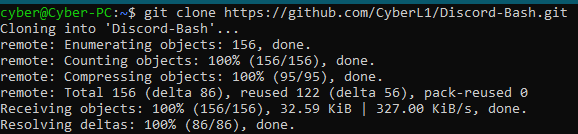
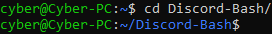

## Prepare the bot to initial setup

In a terminal in the bot folder run the following:  

1. `git clone https://github.com/CyberL1/Discord-Bash.git`  

<figure>
    
    <figcaption>Cloning the repository</figcaption>
</figure>

2. `cd Discord-Bash`

<figure>
    
    <figcaption>Entering the repository directory</figcaption>
</figure>

## Requirements
 - `git` can be installed with `sudo apt install git`
 - `node` [Version 12.0.0 or higher](https://github.com/nodesource/distributions#installation-instructions){target="_blank"}
 - `wget` can be installed with `sudo apt install wget`